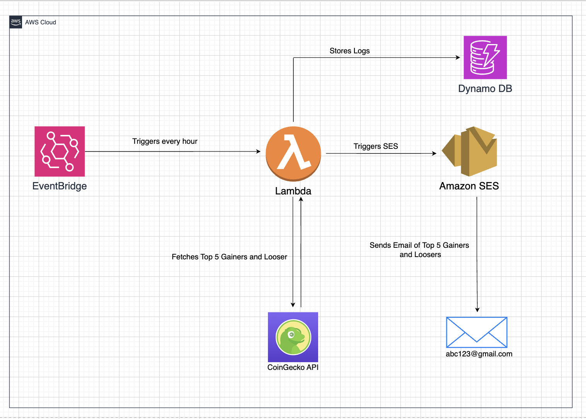
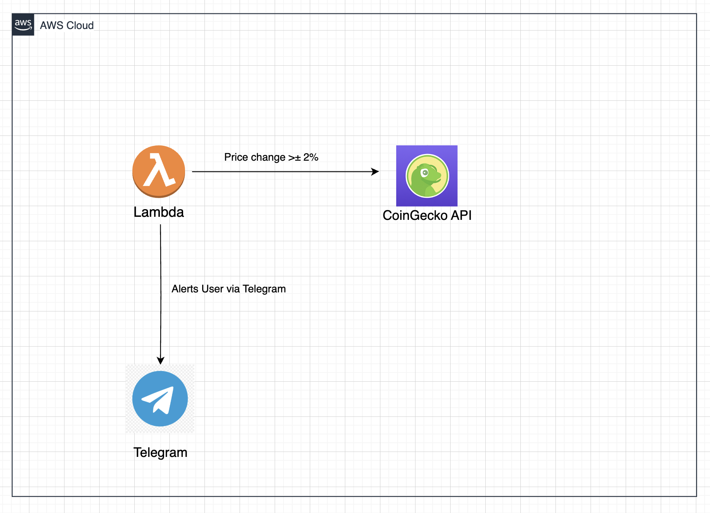
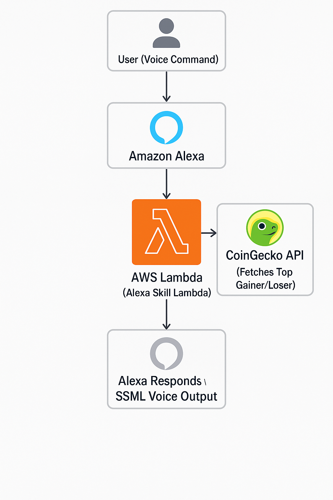

# 🪙 Crypto Monitoring & Notification System

A fully cloud-native, real-time cryptocurrency monitoring system built on AWS, leveraging services like Lambda, S3, DynamoDB, and EventBridge. A real-time, serverless cryptocurrency monitoring system built on AWS that leverages Alexa, Email (SES), and Telegram Bot API to deliver automated market updates and alerts using live data from the CoinGecko API.

---

## 🚀 Project Overview

**Crypto Monitoring & Notification System** is a real-time, serverless application built with **AWS** services and **Python** to track cryptocurrency market trends and deliver updates across multiple channels.

### 🔧 Key Features

* 🔊 **Voice Integration with Alexa** — Ask Alexa for the top crypto gainer or loser using custom intents.
* 📬 **Automated Email Reports** — Sends hourly updates of the top gainer and loser via email using **AWS SES**.
* 📲 **Telegram Alerts** — Instantly notifies the user if **Bitcoin’s price changes by ±2%** using the **Telegram Bot API**.
* ⚡ **Event-Driven Architecture** — Uses **AWS Lambda**, **EventBridge**, and **DynamoDB** for a fully serverless, automated data pipeline.
* 🌐 **Live Data from CoinGecko API** — Fetches real-time cryptocurrency data from a trusted public API.

---

## 🧱 Tech Stack

* **Programming Language**: Python
* **Cloud Platform**: AWS (Lambda, EventBridge, SES, DynamoDB, S3)
* **APIs**: CoinGecko REST API, Telegram Bot API
* **Voice Interface**: Alexa Skill Kit

---

## 🗂 Project Structure

* `lambda_function.py` — The Lambda function that integrates with the CoinGecko API, processes the data, and sends notifications via Alexa, Email, and Telegram.
* `alexa_skill.py` — Alexa skill handler, processes voice commands and provides responses based on crypto data.
* `/assets` — Folder containing all architecture diagrams and system flow images.

---

## 🧩 Architecture Diagrams

Below are the architecture diagrams illustrating different components of the Crypto Monitoring & Notification System:

1. **Overall Architecture**
   
   *Illustrates the complete system workflow and AWS services involved.*

2. **AWS Services Integration**
   
   *Shows how AWS Lambda, EventBridge, SES, and DynamoDB work together.*

3. **Alexa Integration Architecture**
   
   *Demonstrates the voice interface and Alexa skill integration.*

---

## 💻 Setup & Installation

### Prerequisites:

* AWS Account
* AWS CLI Installed
* Python 3.x
* Node.js (for Alexa skill)

### Steps:

1. Clone this repository:

   ```bash
   git clone https://github.com/yourusername/crypto-monitoring-system.git 
   ```
