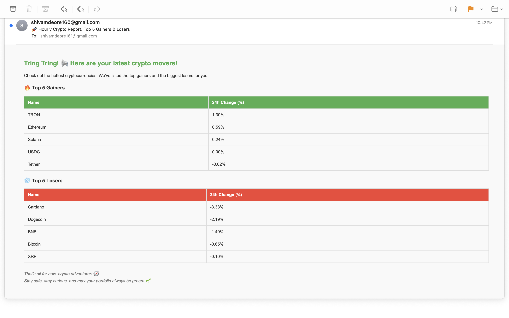
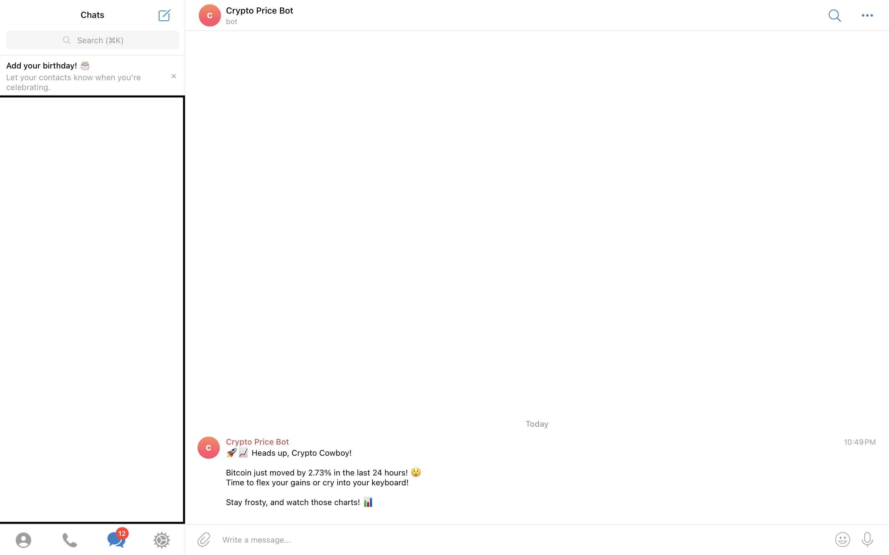
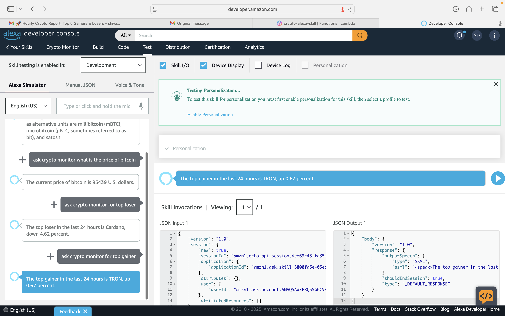

# 🪙 Crypto Monitoring & Notification System

A fully cloud-native, real-time cryptocurrency monitoring system built on AWS, leveraging services like Lambda, S3, DynamoDB, and EventBridge. This serverless system leverages Alexa, Email (SES), and Telegram Bot API to deliver automated market updates and alerts using live data from the CoinGecko API.

---

## 🔍 Project Overview

**Crypto Monitoring & Notification System** is a real-time, serverless application built with **AWS** services and **Python** to track cryptocurrency market trends and deliver updates across multiple channels.

### 🔧 Key Features

- 🔊 **Voice Integration with Alexa**  
  Ask Alexa for the top crypto gainer or loser using custom intents.

- 📬 **Automated Email Reports**  
  Sends hourly updates of the top gainer and loser via email using **AWS SES**.

- 📲 **Telegram Alerts**  
  Instantly notifies the user if **Bitcoin’s price changes by ±2%** using the **Telegram Bot API**.

- ⚡ **Event-Driven Architecture**  
  Uses **AWS Lambda**, **EventBridge**, and **DynamoDB** for a fully serverless, automated data pipeline.

- 🌐 **Live Data from CoinGecko API**  
  Fetches real-time cryptocurrency data from a trusted public API.

---

## 📈 Use Cases

- 💬 "Alexa, ask CryptoBot who is the top gainer today?"
- 📧 Receive hourly crypto updates in your inbox.
- 🔔 Get Telegram alerts when Bitcoin shifts ±2%.

---

## 🧩 Architecture Diagrams

Below are the architecture diagrams illustrating different components of the Crypto Monitoring & Notification System:

1. **Hourly Email Notification Architecture via Amazon SES**  
     
   *Illustrates how the system fetches crypto data and sends hourly updates via email using AWS services.*

2. **Telegram Price Alert Architecture**  
     
   *Shows how AWS Lambda and the Telegram Bot API work together for price alerts.*

3. **Alexa Voice Command Integration**  
     
   *Demonstrates the voice interface workflow with Alexa Skills and AWS Lambda.*

---

## 🧪 Demo / Screenshots

1. **Hourly Email Report**  
   

2. **Telegram Price Alert**  
   

3. **Alexa Voice Demo**  
   

---

## 🧱 Tech Stack

- **Programming Language:** Python  
- **Cloud Platform:** AWS (Lambda, EventBridge, SES, DynamoDB, S3)  
- **APIs:** CoinGecko REST API, Telegram Bot API  
- **Voice Interface:** Alexa Skill Kit  

---

## 🧠 What I Learned

- Designing serverless systems using AWS  
- Integrating Alexa with AWS Lambda  
- Scheduling Lambda using EventBridge  
- Using SES, Telegram Bot, and REST APIs for real-time notifications  
- Storing and structuring logs using DynamoDB and S3  
- Error handling and retries in cloud-native workflows  

---

## 🗂 Project Structure

- `lambda_function.py` — The Lambda function integrating with the CoinGecko API, processing data, and sending notifications via Alexa, Email, and Telegram.  
- `alexa_skill.py` — Alexa skill handler that processes voice commands and provides crypto data responses.  
- `/assets` — Folder containing architecture diagrams and system flow images.

---

## 💻 Setup & Installation

### Prerequisites

- AWS Account  
- AWS CLI installed  
- Python 3.x  
- Node.js (for Alexa skill development)  

### Steps

1. Clone this repository:

   ```bash
   git clone https://github.com/yourusername/crypto-monitoring-system.git

   ```
## 🏷️ Relevant Badges


